# Identificación de Publicaciones Desinformativas y Polarización Ideológica

## Descripción general
Este proyecto se enfoca en detectar publicaciones potencialmente desinformativas (por ejemplo, fake news). Para lograrlo, se han entrenado y comparado diversos modelos de clasificación de texto, desde enfoques de aprendizaje automático tradicional hasta métodos de aprendizaje profundo.
---

## Objetivos del proyecto

- **Clasificación de textos con diferentes representaciones vectoriales**: Clasificación de textos con diferentes representaciones vectoriales: Se emplean varias formas de representar el texto numéricamente, incluyendo TF-IDF (frecuencias de término ponderadas por inverso de frecuencia en documentos), Word2Vec (vectores de palabras entrenados para capturar similitudes semánticas) y embeddings de BERT preentrenados. Sobre estas representaciones, se prueban modelos supervisados clásicos, en particular un Random Forest y una red neuronal MLP simple implementada en PyTorch, para distinguir entre noticias reales y potencialmente desinformativas.

- **Fine-tuning de un modelo Transformer**: Se ajusta finamente un modelo tipo BERT con las noticias originales, para realizar clasificación binaria (verdadero vs fake news). Este entrenamiento de extremo a extremo permite que el modelo Transformer aprenda características lingüísticas específicas de nuestro conjunto de datos.

- **Evaluación rigurosa y comparación de modelos**: Todos los enfoques se evalúan utilizando métricas estándar de clasificación, incluyendo accuracy (exactitud global), F1-score (media armónica de precisión y recall) y ROC-AUC (área bajo la curva ROC) para comparar el rendimiento. Se busca determinar qué modelo ofrece los mejores resultados en la detección de desinformación.

---

## Datos utilizados
El conjunto de datos utilizado proviene de una fuente pública de noticias etiquetadas como reales o falsas. Incluye artículos de prensa en inglés tomados de agencias de noticias confiables (por ejemplo, Reuters) junto con artículos de sitios web de dudosa credibilidad o conocidos por difundir desinformación. Cada ejemplo en la base de datos contiene el título, el texto completo de la noticia y una etiqueta binaria ( label ) indicando su veracidad: 1 para noticias reales y 0 para noticias potencialmente falsas o engañosas. En total, la base de datos contaba con cerca de 40.000 noticias, balanceadas aproximadamente entre ambos tipos (real vs. falsa).

    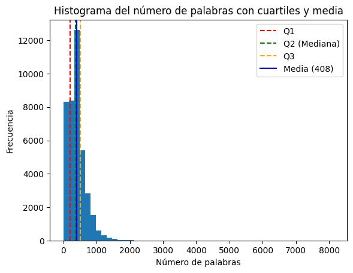
    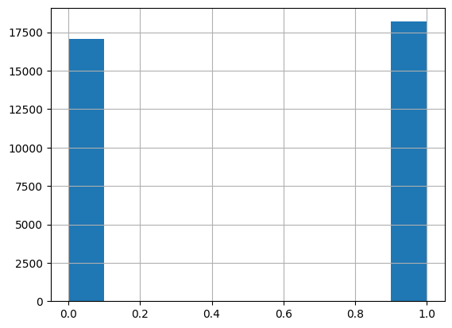

Antes de entrenar los modelos, se realizó una limpieza y preprocesamiento de los textos. Un hallazgo importante del análisis exploratorio fue que muchas noticias reales incluían la palabra "Reuters" en el cuerpo del texto, dado que provenían de dicha agencia, mientras que las falsas no. Para evitar que los modelos aprendieran simplemente esta “trampa” de clasificación, decidimos eliminar menciones explícitas de la fuente en el texto. De este modo, los algoritmos deben basarse en el contenido lingüístico y no en metadatos accidentales para decidir la veracidad.

    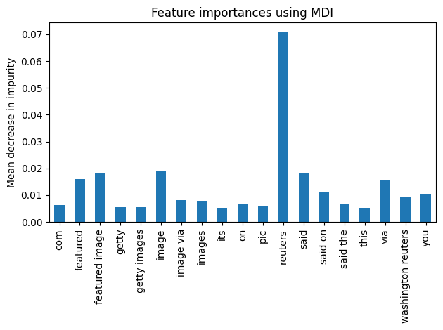
    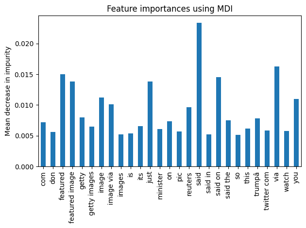

---

## Técnicas de modelado

En este proyecto se probaron varias técnicas de representación de texto y algoritmos de clasificación, combinándolos de la siguiente forma:
- **Representación TF-IDF y Random Forest**: Se convierte cada documento en un vector de características usando TF-IDF, que refleja la importancia de cada término en el documento frente al corpus completo. Con estos vectores dispersos de alta dimensión, se entrena un Random Forest (implementado con Scikit-learn) como clasificador. Los Random Forest son conjuntos de árboles de decisión que suelen manejar bien datos con muchas características y ofrecer interpretabilidad mediante la importancia de variables (palabras más determinantes para la clasificación).

- **Word2Vec + Modelos supervisados**: Se entrenó un modelo Word2Vec (utilizando Gensim) sobre el conjunto de noticias para obtener embeddings de 300 dimensiones para cada palabra. A continuación, para cada noticia se construye su vector de documento promediando los vectores Word2Vec de las palabras que contiene (también se exploraron variantes como sumar vectores). Estos vectores densos capturan cierta semántica del texto. Sobre esta representación más compacta, se evaluaron tanto un Random Forest como una red neuronal MLP simple. La red MLP (Perceptrón multicapa) se implementó en PyTorch con una arquitectura sencilla: varias capas densas con función de activación ReLU y dropout, terminando en una salida sigmoidal para predecir la probabilidad de la clase positiva.
- **BERT embeddings + Clasificadores**: Se utilizaron embeddings preentrenados de BERT para cada documento, sin fine-tuning inicial. Con el tokenizer y modelo preentrenado (uncased de HuggingFace Transformers), cada texto se tokenizó y se extrajo el embedding del token (vector de 768 dimensiones) como representación del documento. Estos embeddings contextuales capturan relaciones más profundas del lenguaje. Luego, de forma similar, se entrenó un Random Forest y una MLP tomando estos embeddings BERT como input, para comparar su rendimiento con las técnicas anteriores.
- **Fine-tuning de BERT (Transformers)**:Finalmente, se realizó un ajuste fino de un modelo BERT en inglés sobre nuestra tarea de clasificación binaria. Usando un modelo preentrenado en inglés de HuggingFace. El fine-tuning se hizo durante 3 épocas (epochs) con un optimizador AdamW y tasas de aprendizaje bajas (2e-4, 2e-5, 2e-6), utilizando técnicas estándar para evitar sobreajuste (como validación durante el entrenamiento y selección del mejor modelo según accuracy de validación) y obteniendo el mejor resultado con tasa de aprendizaje 2e-5. Este enfoque permite que el modelo Transformer aprenda características específicas de las noticias verdaderas vs falsas directamente a partir del texto completo, potencialmente capturando matices que las representaciones anteriores puedan pasar por alto.

## Evaluación de Resultados
Todos los modelos se evaluaron utilizando un conjunto de validación (para ajuste de hiperparámetros) y un conjunto de test separado para la comparación final. A continuación se resumen los resultados de las principales configuraciones probadas, reportando métricas de Accuracy (Acc.), F1-score (F1) y ROC-AUC sobre el conjunto de prueba:

| Modelo (Representación)                    | Acc.  | F1    |
|-------------------------------------------|-------|-------|
| Random Forest (TF-IDF)                     | ~96%  | ~96%  |
| MLP (TF-IDF)                               | ~97%  | ~97%  |
| Random Forest (Word2Vec promedio)          | ~95%  | ~95%  |
| MLP (Word2Vec promedio)                    | ~97%  | ~97%  |
| Random Forest (BERT embedding [CLS])       | ~91%  | ~91%  |
| MLP (BERT embedding [CLS])                 | ~95%  | ~95%  |
| BERT Transformer fine-tune (HuggingFace)   | 96–97%| 96–97%|

Observaciones: En general, todos los métodos lograron un desempeño muy alto en esta tarea de detección de noticias desinformativas. Los enfoques basados en TF-IDF obtuvieron un accuracy alrededor del 96-97%, que inicialmente llamó la atención por su valor inusualmente alto. Investigando las características más importantes que usaba el Random Forest con TF-IDF, se confirmó que el modelo aprovechaba la presencia de ciertos términos distintivos (como la palabra "Reuters") para distinguir noticias reales. Esto explica que incluso un modelo relativamente simple alcance casi un 98% de acierto en el conjunto de datos original. Al remover esas pistas obvias del texto, la precisión bajó ligeramente pero se mantuvo alta (~96%), lo que indica que todavía existen patrones léxicos y de estilo que diferencian las noticias verdaderas de las falsas en este dataset.

Los modelos basados en Word2Vec también demostraron buen rendimiento (~95% de F1), aunque ligeramente inferior a TF-IDF en este caso. Esto puede deberse a que al promediar vectores de palabras se pierde información de orden y contexto específico que resultaba útil para la tarea. Aun así, tanto el Random Forest como la MLP con vectores promedio de Word2Vec superaron con claridad el 90% de accuracy, indicando que las noticias falsas en el corpus tienen un contenido semántico identificable de forma agregada.

En cuanto a los embeddings de BERT preentrenado, se observó un caso interesante: al usarlos directamente (sin re-entrenar el modelo) y luego aplicar un clasificador encima, el desempeño inicial fue menor (F1 ~0.91 con Random Forest) en comparación con TF-IDF o Word2Vec. Esto sugiere que, sin fine- tuning, los embeddings de BERT en español no estaban optimizados para separar por sí solos la veracidad de las noticias, tal vez por diferencias de idioma o porque la distinción fake/real no es trivialmente capturada por las dimensiones más generales de BERT. Sin embargo, al utilizar una MLP que pueda introducir no linealidades sobre esos embeddings, la performance mejoró (hasta ~95% de accuracy), cerrando la brecha con los métodos anteriores.

El modelo BERT ajustado finamente directamente con nuestros datos alcanzó la mejor performance global (aproximadamente 96-97% de accuracy y F1 en test), equiparable a los mejores resultados de TF- IDF pero lograda de una manera más generalizable. Este modelo Transformer fine-tuned fue capaz de aprender patrones complejos del lenguaje de las noticias verdaderas y falsas. Es destacable que logró dicho rendimiento trabajando sobre texto en crudo y en español, lo que demuestra el poder de transferencia de los Transformers multilingües. Dado que el modelo aprende internamente qué señales diferencian a cada clase, potencialmente es menos dependiente de pistas obvias como la fuente y más de qué se dice y cómo se dice en la noticia (por ejemplo, puede captar que las noticias falsas tienden a usar un lenguaje más exagerado o partidista, mientras que las reales mantienen un tono objetivo).

En resumen, todas las aproximaciones alcanzaron puntuaciones muy altas (F1 > 0.90) en este conjunto de datos, con ligeras ventajas para el modelo BERT fine-tune y para los clasificadores que aprovechan características lexicográficas sencillas. Estos resultados, no obstante, deben interpretarse con precaución: la alta efectividad se debe en parte a la naturaleza del dataset y sus sesgos (fuentes diferenciadas, temas específicos de las noticias falsas, etc.). En un escenario más general o con noticias menos claramente diferenciadas, es posible que se requieran métodos más sofisticados o un preprocesamiento que elimine sesgos para obtener rendimientos similares.

### Curvas ROC y matríz confusión
Las siguientes curvas ROC y matrices de confusión se han calculado sobre los conjuntos para comparar el rendimiento de los modelos en distintos umbrales de decisión.

#### TF-IDF
- Random Forest

    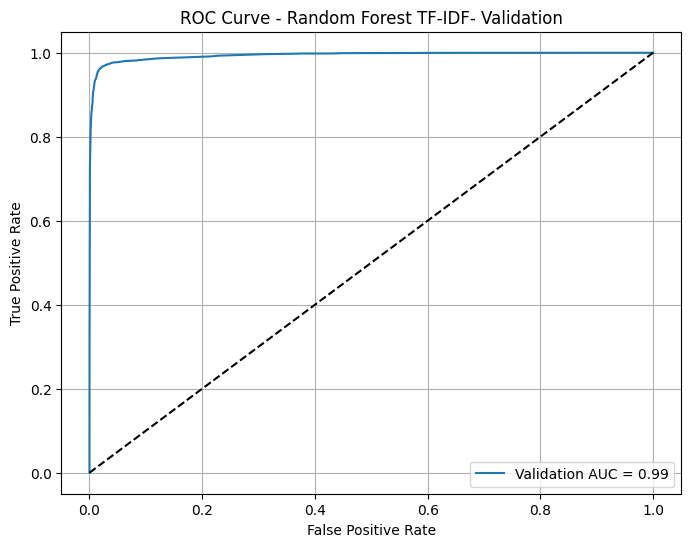
    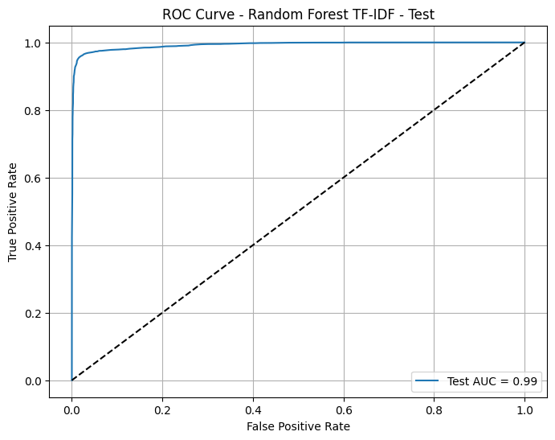

    
    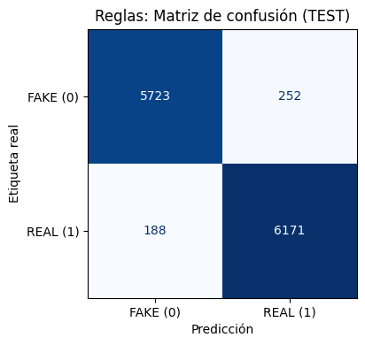

- MLP

    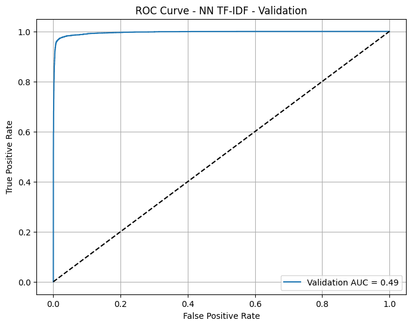
    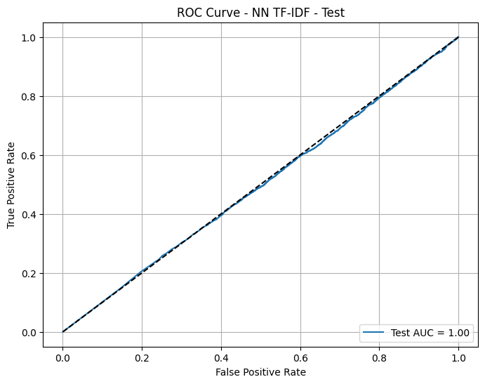

    
    

#### Word2Vec (promedio)
- Random Forest

    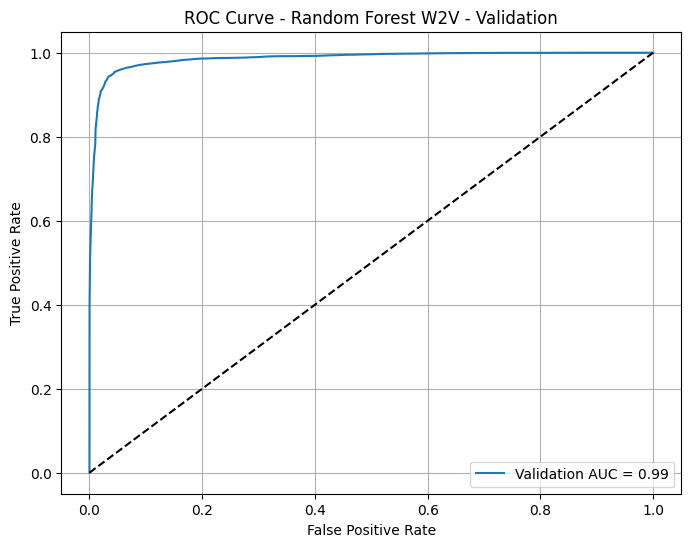
    

    
    

- MLP

    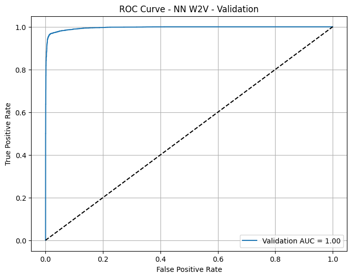
    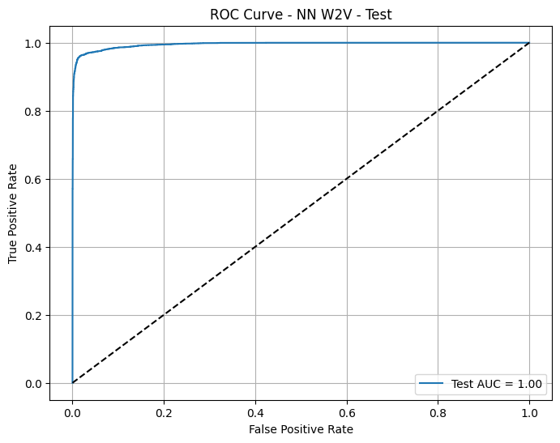

    
    

#### BERT embeddings ([CLS])
- Random Forest

    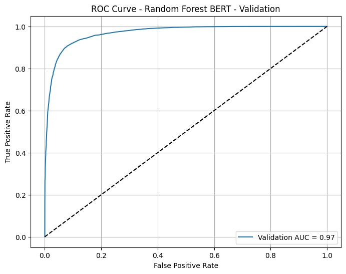
    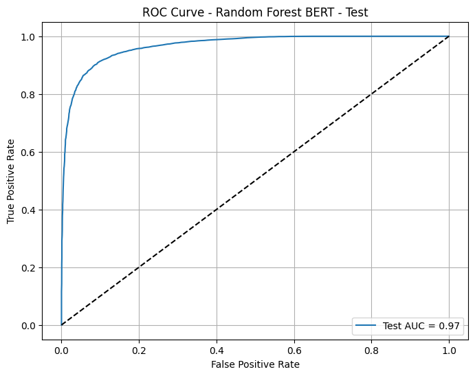

    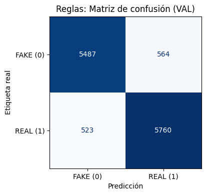
    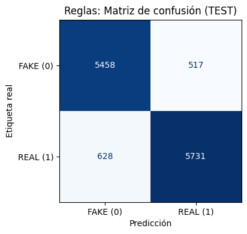

- MLP

    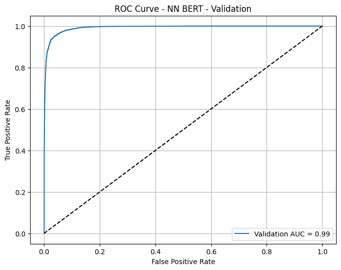
    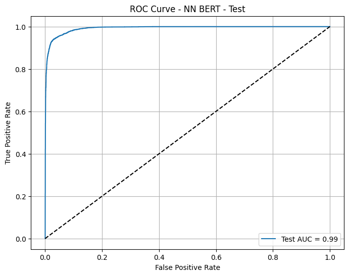

    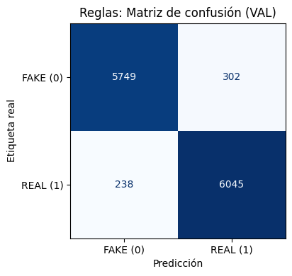
    

#### BERT fine-tuning

    

    

## Baseline basado en reglas
Para la extensión del proyecto, se ha definido un baseline basado en reglas para clasificar noticias como FAKE (0) o REAL (1), utilizando señales simples extraídas del título, los dominios de las URLs y características de estilo asociadas al clickbait.

El aprendizaje de las señales léxicas se ha realizado exclusivamente a partir de los títulos, ya que estos suelen concentrar con mayor intensidad elementos de sensacionalismo o clickbait, rasgos que aparecen con más frecuencia en noticias falsas que en el cuerpo completo de la noticia. En cambio, para el aprendizaje de los dominios URL, se ha utilizado tanto el título como el contenido, dado que los enlaces pueden aparecer en cualquiera de ambos campos.

Una vez aprendidas estas señales, se muestran las palabras y expresiones más representativas tanto de las noticias falsas como de las verdaderas. En el caso de las fake news, se observa que predominan palabras en mayúsculas, típicamente asociadas al clickbait, así como términos de exageración o sensacionalismo como wow, disgusting o hilarious. Por el contrario, las noticias verdaderas presentan términos más neutros y contextuales, como Catalonia, Myanmar o Philippines, relacionados con lugares o hechos informativos concretos.

En cuanto a los dominios URL, como se señaló en el análisis exploratorio inicial, el conjunto de datos incluía la palabra REUTERS en la mayoría de las noticias verdaderas. Dado que esta palabra introduce un fuerte sesgo, se decidió eliminarla del texto antes del entrenamiento. Como consecuencia, los dominios asociados a noticias verdaderas que el baseline aprende son pocos y con baja frecuencia de aparición. En contraste, el modelo identifica varios dominios que aparecen de forma mayoritaria en noticias falsas, clasificándolos como de baja credibilidad.

Finalmente, se ha evaluado este baseline para analizar su rendimiento y compararlo con el resto de modelos y vectorizaciones del proyecto. Los resultados obtenidos han sido sorprendentemente buenos, especialmente en la detección de noticias falsas. Esto puede explicarse porque muchas fake news presentan un estilo claramente sensacionalista o sospechoso de ser clickbait, lo que las hace más fáciles de identificar mediante reglas simples. No obstante, existen también noticias falsas con un tono más neutro, diseñadas para imitar el estilo informativo de las noticias reales, lo que dificulta su detección. De forma similar, las noticias verdaderas suelen mantener un tono serio y objetivo, lo que puede provocar confusiones con aquellas fake news que adoptan un estilo aparentemente informativo.

| Clase | Precisión |
|-------|-----------|
| FAKE (0) | 0.96 |
| REAL (1) | 0.83 |

## Conclusiones
El proyecto demuestra que es posible identificar automáticamente noticias potencialmente desinformativas con una precisión muy elevada utilizando técnicas tanto clásicas como modernas de aprendizaje automático. Modelos sencillos como Random Forest sobre TF-IDF ya logran detectar patrones obvios de diferencia entre noticias reales y falsas, mientras que modelos neuronales y Transformers pueden captar matices más sutiles del lenguaje asociados a la desinformación. La comparación entre métodos reveló que:

- **Importancia de la representación**: La elección de cómo representar el texto influye en el rendimiento. TF-IDF, a pesar de su simplicidad, funcionó sorprendentemente bien en este caso (debido a términos reveladores presentes en las noticias reales). Por otro lado, los embeddings densos (Word2Vec, BERT) ofrecen una representación más general; cuando se complementaron con modelos adecuados, alcanzaron desempeños similares. Esto sugiere que en tareas de fake news detection, las palabras clave y el estilo de redacción pueden ser indicadores tan fuertes como las características semánticas profundas.
- **Modelos clásicos vs. profundos**: No se observó una superioridad abrumadora de los modelos profundos sobre los clásicos en este dataset. De hecho, un modelo MLP sencillo o un Random Forest bien ajustado lograron métricas comparables al Transformer fine-tune. Sin embargo, a largo plazo y con datos más complejos, se espera que un Transformer bien entrenado sea más robusto, ya que entiende contexto y puede generalizar mejor a frases nunca vistas. En nuestro caso, BERT fine-tune efectivamente igualó a los mejores métodos, mostrando su capacidad una vez entrenado con datos específicos.

En conclusión, este proyecto proporciona un README y un marco de trabajo completos para la detección de desinformación en noticias, combinando distintos enfoques de procesamiento de lenguaje natural. Los resultados obtenidos sientan una base sólida, pero también subrayan la importancia de evaluar los modelos en contextos más amplios y con datos controlados para sesgos. 

## Requisitos y Ejecución
Para reproducir los experimentos del proyecto, se recomienda el siguiente entorno y dependencias:
- Python 3 y Jupyter Notebook o similar para ejecutar el código.
- Librerías principales de ciencia de datos: pandas, NumPy, matplotlib (para manipulación de datos y gráficos).
- Scikit-learn: utilizado para el vectorizador TF-IDF y el modelo Random Forest, entre otras utilidades.
- Gensim: utilizado para entrenar el modelo Word2Vec y obtener embeddings de palabras.
- PyTorch: utilizado para implementar y entrenar la red neuronal MLP y para el modelo BERT fine- tune (back-end de entrenamiento).
- HuggingFace Transformers: para cargar el tokenizador y modelo preentrenado BERT en español, y realizar el fine-tuning de la secuencia clasificadora.
- Opcionalmente, sklearn.metrics y otras librerías auxiliares para cálculo de métricas y reporte de resultados.

Los pasos generales para ejecutar serían: **1. Preparar los datos**: Colocar el archivo de dataset público
en el directorio del proyecto y ajustar la ruta en el código de carga (	) si fuera necesario. **2. Preprocesar y vectorizar**: Ejecutar las celdas o scripts que limpian los textos y generan las representaciones TF-IDF, entrenan Word2Vec, obtienen embeddings de BERT, etc. **3. Entrenar los modelos**: Correr secuencialmente el entrenamiento del Random Forest, la red MLP (asegurándose de tener disponible una GPU para acelerar PyTorch si es posible) y el fine-tuning de BERT. Cada sección del código entrena uno de los modelos descritos. **4. Evaluar resultados**: Finalmente, ejecutar las celdas de evaluación que imprimen las métricas (accuracy, F1, ROC-AUC) y comparan los modelos. También revisar las gráficas generadas, como las importancias de palabras en Random Forest o matrices de confusión si se incluyeron, para una comprensión cualitativa.

## Fuente de datos
Dataset público (Kaggle)::  Todas las noticias y comentarios analizados están disponibles públicamente para fines de investigación en `https://www.kaggle.com/datasets/aadyasingh55/fake-news-classification?resource=download&select=train+%282%29.csv`

---